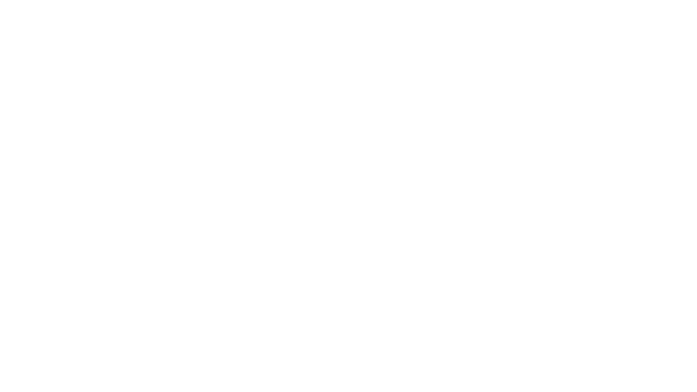

# 1.- How TinyVale Works.

**Welcome to the First Chapter!**

In this section, you're going to learn how the entire TinyVale Compiler works!

***It might've be a little bit scary at first...*** Because of the amount of complexity a compiler can have, with all of the steps required from converting a simple text file, to machine code. **But it's actually more simple than it looks!**

## But first, let's introduce our brand new "TINY CAR FACTORY!"

**This is the best place to get your Tiny Car in no time!** Let's explain the whole ***INCREDIBLE PROCESS FROM START TO FINISH!***

*-- WIP --*